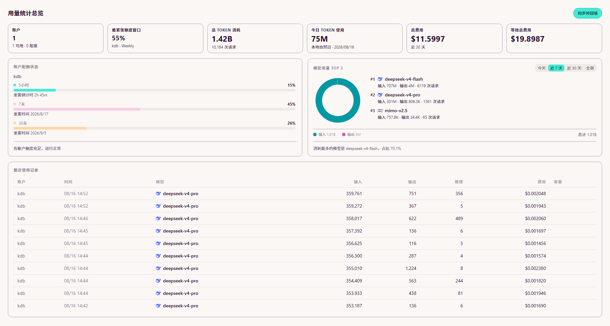
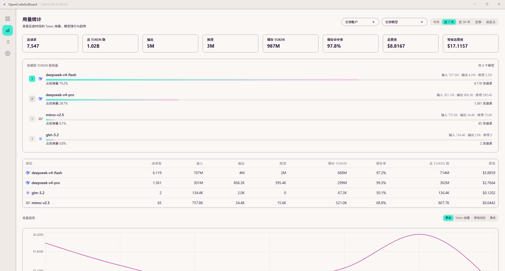
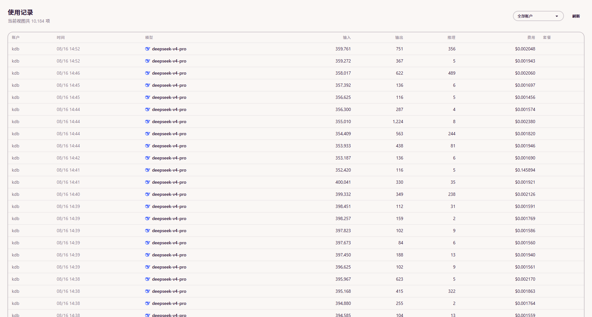
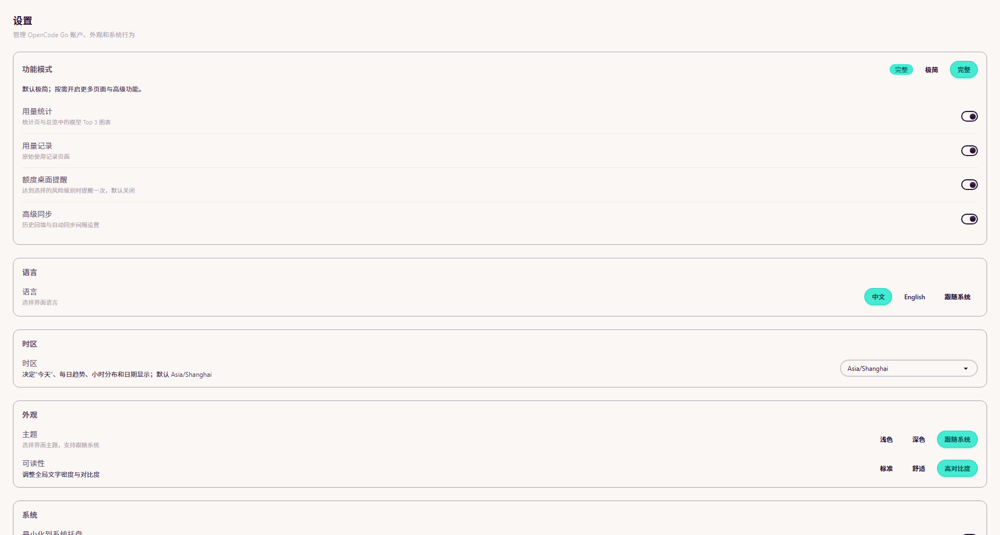

# OpenCodeGoBoard

**English** · [简体中文](README.md)

Repository: [github.com/KDB-Wind/opencodegoboard](https://github.com/KDB-Wind/opencodegoboard) · **Download:** [Latest Releases](https://github.com/KDB-Wind/opencodegoboard/releases/latest)

OpenCodeGoBoard is a small, local-first Windows companion for OpenCode Go. It brings official quota windows and locally synchronized usage into one desktop view: remaining quota and reset times, total and daily Token use, actual and **equivalent cost**, per-model analytics, and raw usage records.

## Highlights

- Small footprint: Tauri + Rust + SQLite; no Electron, Hono, Bun backend, or localhost HTTP service. Measured process-tree private memory is about 159 MB on a 16 GB machine.
- **Equivalent cost:** $15-tier models are ×4 normalized to the $60 tier automatically; the tier table is user-maintainable in Settings.
- Multi-account quota bars for the 5h / 7d / 30d official windows, the tightest quota window, and reset times.
- Token analytics by Today / 7 days / 30 days / All, plus a **custom start/end date range** (for example, exactly yesterday).
- Per-model token breakdowns, cache hit rate, request counts, cost, and an actual-vs-equivalent cost trend.
- Minimal by default; enable stats, records, quota desktop alerts, and advanced sync in **Settings → Feature Mode**.
- English and Chinese interfaces with IANA time-zone analytics and daylight-saving support.
- Auth Cookies stored in the Windows credential vault rather than the application database.

## Screenshots

| Dashboard | Usage Stats |
|-----------|-------------|
|  |  |
| Usage Records | Settings |
|  |  |

## Quick start

1. Fresh installs start in **Minimal mode**. Open **Settings → Feature Mode** if you want more pages, or choose the Full preset.
2. Open **Settings → OpenCode Accounts → Add Account**.
3. Sign in through the built-in browser login, or copy the `auth` cookie from `https://opencode.ai` via browser developer tools and paste it into **Auth Cookie**.
4. Select **Test** to verify the account, then **Sync** to fetch recent usage.
5. Enable **Advanced Sync** before using **Backfill** when you need older records. Choose recent days, an end date, or all history before starting it.
6. If a cookie expires, select **Edit** or **Reauthorize**. Updating an existing account preserves its usage history.

## Application guide

### 1. Dashboard

The Dashboard shows six core cards: account availability, the tightest quota window, total Token consumption, today's Token usage, actual cost, and **equivalent cost** ($15-tier models ×4 normalized to the $60 tier). Below them are per-account quota bars with reset times, recent usage, and a data-health warning when something is incomplete.

Use **Sync Now** when you need fresh data immediately. In Minimal mode it performs incremental sync only; with Advanced Sync enabled it also backfills 90 days of history.

### 2. Token Analytics

(Enable the **Usage Stats** group in Feature Mode first.)

Token Analytics summarizes requests, total/input/output/reasoning tokens, cache hits, cost, and equivalent cost. Use the account and model filters, the Today / 7 days / 30 days / All tabs, or the **Custom** tab with a start and end date. The trend chart can show cost, tokens, requests, or actual-vs-equivalent cost; Today shows the hourly distribution.

### 3. Usage Records

(Enable the **Usage Records** group in Feature Mode first.)

Usage Records shows the raw request list: model, input/output/reasoning tokens, cache hit/write, cost, account, session, project and timestamp. Filter by account and page through the list.

### 4. Settings

- **Feature Mode:** choose the Minimal or Full preset, or toggle the four feature groups individually.
- **Language:** English, Chinese, or follow the operating system.
- **Time zone:** defaults to `Asia/Shanghai`; choose any available IANA zone such as `America/New_York`. It changes Today, hourly analytics, custom date ranges, and displayed timestamps.
- **Appearance and readability:** theme and reading-density controls.
- **System behavior:** tray mode. Desktop quota alerts appear with the Quota Desktop Alerts group and are off by default.
- **Accounts:** add, enable/disable, test, edit/reauthorize, sync, backfill, or delete an account. Deleting an account also deletes its related local history; use Edit when only the cookie changed.
- **Model Quota & Pricing:** maintain each model's monthly quota tier ($15 / $60) used by equivalent cost; defaults come from the OpenCode docs dated 2026-08-15 and can be overridden or extended.
- **Auto sync:** choose whether synchronization runs in the background. The interval appears with Advanced Sync.
- **History backfill:** shown with Advanced Sync; select recent N days, a cutoff date, or all history.

## Privacy and data

Usage and quota data stay in a local SQLite database. Account credentials are stored in Windows Credential Manager.

## Development

Install Node.js, pnpm, Rust, and the Windows WebView2 development prerequisites.

```bash
pnpm install
pnpm dev
```

Validation and packaging:

```bash
pnpm test
pnpm build
pnpm a11y:check
pnpm benchmark:db
pnpm dist
```

The NSIS installer is written to `src-tauri/target/release/bundle/nsis/`. See [docs/RELEASE.md](docs/RELEASE.md) for signing, updater, checksums, and rollback; [docs/ROADMAP.md](docs/ROADMAP.md) for delivery status; and [docs/PERFORMANCE.md](docs/PERFORMANCE.md) for measured baselines.

## Project lineage and acknowledgements

OpenCodeGoBoard is a Tauri + Rust rewrite of **[OpenCodeBoard](https://github.com/KDB-Wind/opencodeboard)**, which is a personal-use fork of **[68hub](https://github.com/evanfu0110/68hub)** (MIT License). This repository is a refactor rather than a git fork; the original MIT copyright notice is retained in `LICENSE`, and the lineage is recorded in `NOTICE.md`.

Thanks to [evanfu0110/68hub](https://github.com/evanfu0110/68hub) for the initial baseline.

## Architecture

```text
src/                  React/Vite interface and typed Tauri IPC client
src-tauri/src/        Rust commands, SQLite, sync, quota logic, and system integration
scripts/              Redaction, accessibility, benchmark, and release checks
docs/                 Roadmap, constraints, performance, accessibility, and release notes
```

See [NOTICE.md](NOTICE.md) and [LICENSE](LICENSE) for attribution. A real-account and clean-Windows-VM acceptance pass is required before a public release.
